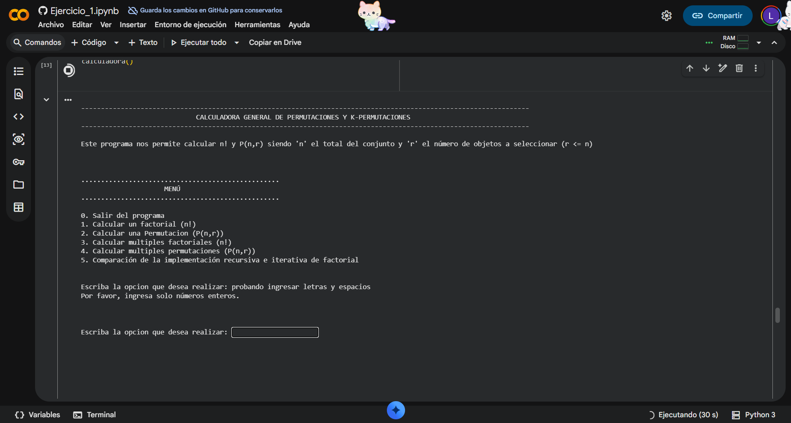
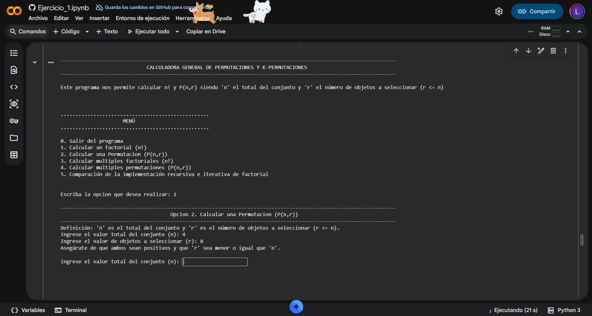

# Ejercicio 1: Calculadora de Factoriales y Permutaciones

>  Toda la fundamentación matemática (títulos, fórmulas, descripciones teóricas y conclusiones de rendimiento) está documentada al detalle dentro de este cuaderno interactivo. Puede revisarlo directamente aquí en GitHub haciendo clic en el botón de **"View Notebook"** de arriba; si desea ejecutar el código, la plataforma le habilitará la opción de abrirlo en el entorno de Google Colab.

## Resumen del ejercicio

Este ejercicio está dividido en dos partes principales:
1. **La Calculadora:** Un menú interactivo que procesa tanto el factorial puro de un número ($n!$) como la fórmula de permutaciones $P(n, r) = \frac{n!}{(n-r)!}$, validando de forma estricta las entradas para evitar errores matemáticos, números negativos o el ingreso de letras.
2. **La Comparativa:** Una prueba de eficiencia que calcula el tiempo exacto en microsegundos de dos enfoques (iterativo vs. recursivo), demostrando de forma práctica las ventajas de optimizar el uso de la memoria en Python ante números grandes.

---

## Instrucciones de Ejecución en Google Colab

El código de este ejercicio está estructurado en módulos independientes dentro del cuaderno `Ejercicio_1.ipynb`. Para ejecutar la aplicación correctamente, siga estos pasos:

1. Dé clic en el botón **Open In Colab** ubicado en la parte superior de esta portada.
2. Una vez abra el entorno de Colab, vaya a la sección **`4. Codigo Funcional`**.
3. Ejecute primero el bloque de celdas bajo el subtítulo **`Funciones`** (esto cargará los motores matemáticos, validaciones y librerías `time` y `sys` en la memoria del entorno).
4. Posteriormente, ejecute la celda bajo el subtítulo **`Programa Principal`** (la cual invoca la función maestra `calculadora()`).
5. Interactúe con el menú numérico (opciones 0 a 5) directamente desde la consola interactiva que se desplegará en la parte inferior de la celda.

---

## Estructura de este Módulo en GitHub

* `Ejercicio_1.ipynb`: Cuaderno de desarrollo completo con el reporte y el código segmentado en bloques.
* `evidencias/`: Carpeta que almacena las capturas de pantalla del programa en ejecución para la verificación del laboratorio.

---

## Evidencias de Pruebas 

Para demostrar la estabilidad del programa, se ejecutó una prueba real por cada una de las opciones disponibles en el menú interactivo, organizadas secuencialmente:

### Prueba 1: Caso Factorial de un Número ($n!$)
* **Opción seleccionada en el menú:** Opción 1 (Calcular el factorial de un número)
* **Datos ingresados:** $n = 5$
* **Procedimiento en pantalla:** El programa calcula el producto consecutivo desde 1 hasta 5 de forma iterativa.
* **Resultado obtenido:** `120`

---

### Prueba 2: Caso Permutación Individual $P(10, 3)$
* **Opción seleccionada en el menú:** Opción 2 (Calcular una Permutación (P(n,r)))
* **Datos ingresados:** Total del conjunto ($n$) = 10 | Objetos a seleccionar ($r$) = 3
* **Procedimiento en pantalla:** El programa calcula la resta del denominador ($10 - 3 = 7$) y muestra gráficamente cómo simplifica la división de $10!$ entre $7!$.
* **Resultado obtenido:** `720`
  

---

### Prueba 3: Caso de Múltiples Factoriales en Bloque
* **Opción seleccionada en el menú:** Opción 3 (Calcular múltiples factoriales)
* **Datos ingresados:** Se ingresa el límite superior para evaluar varios factoriales seguidos (por ejemplo: del 1 al 5).
* **Procedimiento en pantalla:** El programa procesa en bucle cada valor de forma secuencial y despliega los resultados organizados.
* **Resultados obtenidos:** $1! = 1$, $2! = 2$, $3! = 6$, $4! = 24$, $5! = 120$.
  

---

### Prueba 4: Caso Especial de Múltiples Permutaciones $P(5,5)$, $P(8,0)$ y $P(1,1)$
* **Opción seleccionada en el menú:** Opción 4 (Calcular multiples permutaciones (P(n,r)))
* **Datos ingresados:** Casos especiales combinatorios como selección completa ($n=5, r=5$), elemento neutro ($n=8, r=0$) y límites mínimos ($n=1, r=1$).
* **Procedimiento en pantalla:** Procesa múltiples parejas de $(n, r)$ evaluando tanto la división por $0!$ como los límites inferiores.
* **Resultados obtenidos:** $P(5,5) = 120$, $P(8,0) = 1$, $P(1,1) = 1$.
  

---

### Prueba 5: Caso de Comparativa de Eficiencia y Rendimiento
* **Opción seleccionada en el menú:** Opción 5 (Comparar tiempo de ejecución (Iterativo vs Recursivo))
* **Datos ingresados:** Un número alto para forzar el cálculo (por ejemplo: $n = 1000$).
* **Procedimiento en pantalla:** Lanza en paralelo el motor **Iterativo** y el **Recursivo**, activando los contadores del módulo `time` y `sys` para medir los microsegundos de ejecución.
* **Resultado obtenido:** El método iterativo resuelve en pocos microsegundos, mientras que el recursivo satura la pila de llamadas disparando de forma controlada el error de desbordamiento (*Stack Overflow*).

---

## Control de Errores y Validaciones

El código está blindado para evitar caídas o errores en la terminal mediante dos filtros principales, los cuales fueron testeados con éxito frente a fallos de usuario:

### 1. Evita datos inválidos (Bloque Try/Except)
Si se ingresan letras, espacios vacíos o caracteres inválidos, el programa detecta la excepción de valor (`ValueError`), evita que la terminal colapse, despliega un mensaje de advertencia y reinicia el bucle de captura de datos de forma segura.

* **Resultado esperado:** Mensaje en consola `Por favor, ingresa solo números enteros.`
  

---

### 2. Control matemático (Condicionales Lógicos)
El sistema evalúa los datos antes de operar y bloquea de inmediato valores negativos o combinaciones imposibles en la combinatoria (como intentar sacar un subgrupo $r$ que sea mayor al total del conjunto $n$).

* **Resultado esperado:** Mensaje en consola `Asegúrate de que ambos sean positivos y que 'r' sea menor o igual que 'n'.`
  

