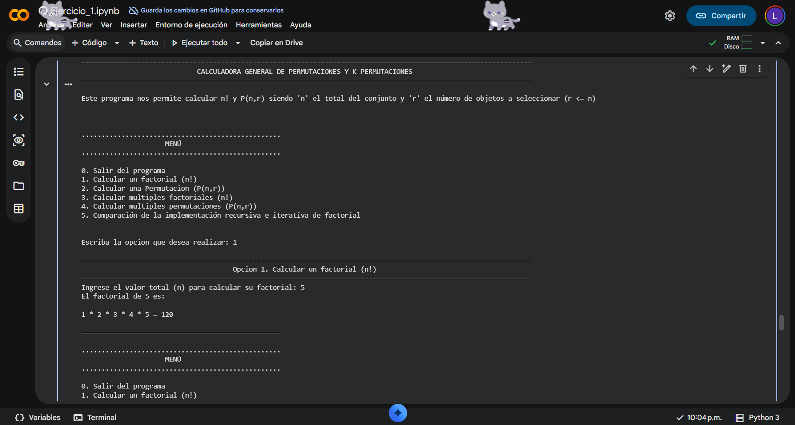
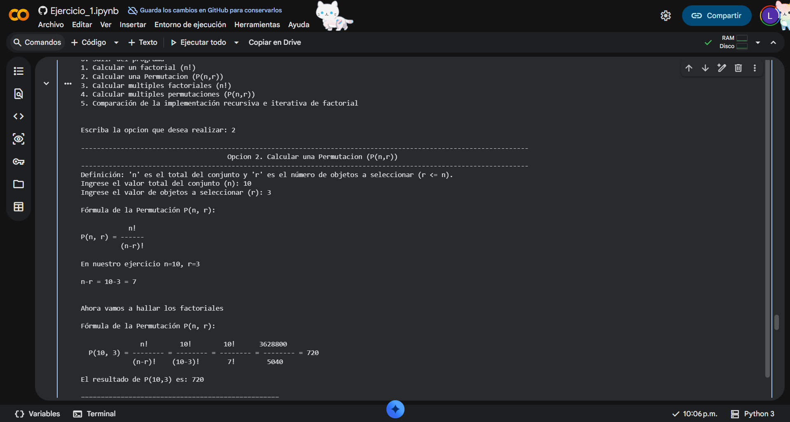
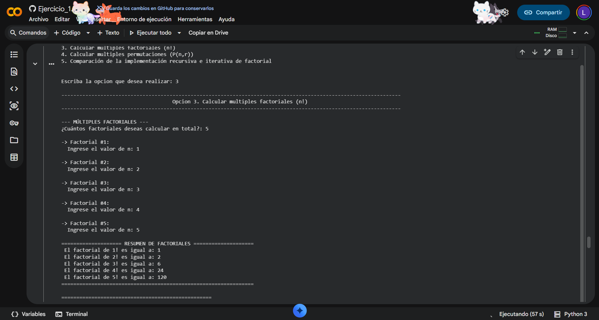
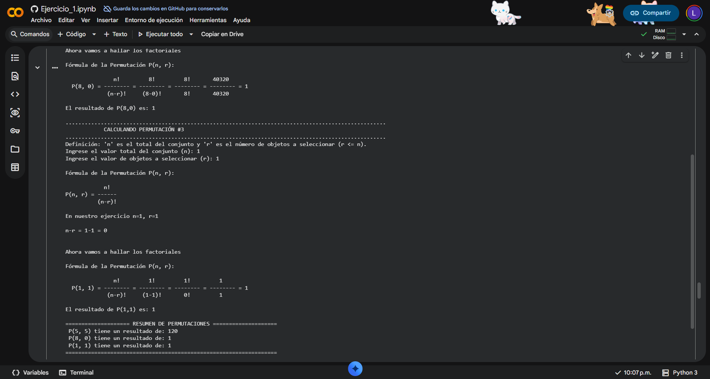
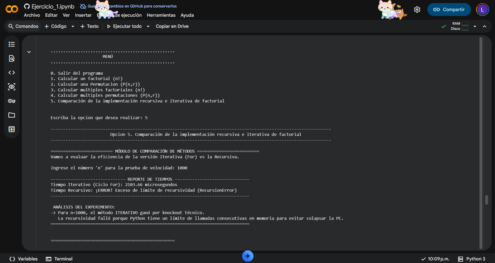

# Ejercicio 1: Calculadora de Factoriales y Permutaciones

Toda la fundamentación matemática detallada (títulos, fórmulas y descripciones teóricas) se encuentra explicada paso a paso dentro del cuaderno interactivo de Colab. Puedes ejecutar y revisar el reporte completo haciendo clic en el botón de arriba.

---

## Resumen del Ejercicio

Este módulo resuelve dos problemas clave de matemáticas discretas y eficiencia de código:
1. **Conteo Combinatorio:** Cálculo visual y exacto de $k$-permutaciones bajo la fórmula $P(n, r) = \frac{n!}{(n-r)!}$, controlando que no ocurran divisiones por cero o ingresos de datos inválidos.
2. **Análisis de Rendimiento:** Un experimento empírico que mide en microsegundos el rendimiento de la aproximación **Iterativa (ciclo For)** contra la **Recursiva**, evidenciando los límites físicos de la memoria de la computadora (*Stack Overflow*).

---

## Estructura de este Módulo

* `calculadora.py`: Código fuente limpio de la aplicación, exportado directamente desde el entorno de desarrollo.
* Archivo de cuaderno.
* `evidencias/`: Carpeta que almacena las capturas de pantalla del programa en ejecución.

---

## Evidencias de Pruebas Ejecutadas

Para demostrar la estabilidad del programa y comprobar los casos obligatorios del laboratorio, se realizaron las siguientes pruebas en la terminal:

### Prueba 1: Caso Base $P(10, 3)$
* **Entrada:** Opción 2 | $n = 10, r = 3$
* **Resultado:** `720`

### Prueba 2: Caso de Enteros Grandes $P(20, 5)$
* **Entrada:** Opción 2 | $n = 20, r = 5$
* **Resultado:** `1860480`

### Prueba 3: Selección Completa del Grupo $P(5, 5)$
* **Entrada:** Opción 2 | $n = 5, r = 5$
* **Resultado:** `120` *(Demuestra que $P(5,5)$ equivale al factorial puro $5!$, ya que el denominador se convierte en $0! = 1$)*.

### Prueba 4: Caso del Elemento Neutro $P(8, 0)$
* **Entrada:** Opción 2 | $n = 8, r = 0$
* **Resultado:** `1` *(Validación correcta: solo hay una forma de ordenar cero objetos)*.

### Prueba 5: Valores Mínimos $P(1, 1)$
* **Entrada:** Opción 2 | $n = 1, r = 1$
* **Resultado:** `1`

---

## Control de Errores y Validaciones
El programa cuenta con filtros con bloques `try/except` y condicionales lógicos para evitar caídas:
* Evita el ingreso de letras o caracteres vacíos relanzando la solicitud del dato.
* Bloquea combinaciones matemáticamente imposibles (como valores negativos o casos donde $r > n$).

---

## ⏱️ Conclusión del Análisis de Eficiencia (Opción 5)
Al ejecutar el módulo de comparación de rendimiento, se comprobó que el **enfoque iterativo** es drásticamente superior al recursivo en el manejo de memoria. Mientras que el ciclo `for` calcula factoriales de números grandes en pocos microsegundos sin despeinarse, el método recursivo satura la pila de llamadas del sistema de Python detonando un `RecursionError` debido al desbordamiento de memoria.
