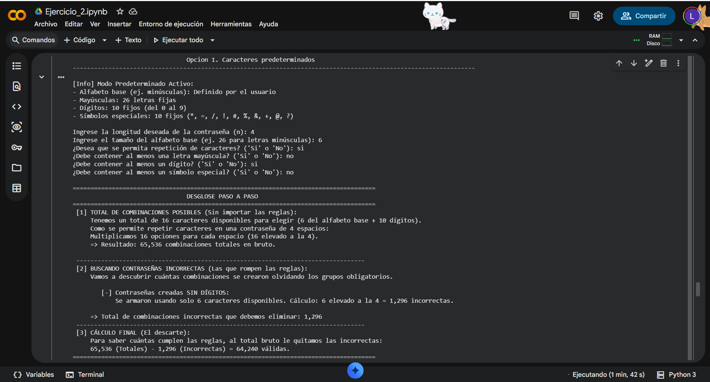
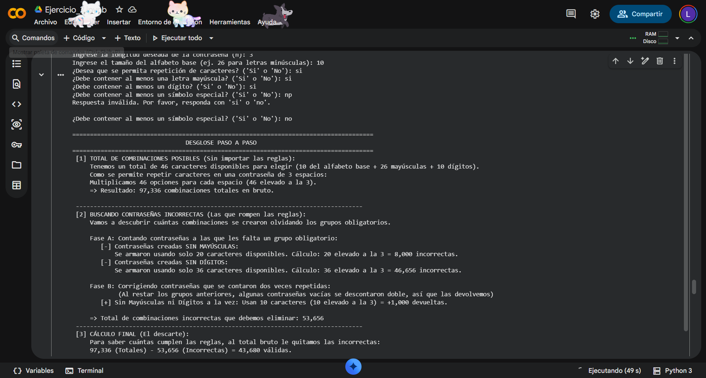
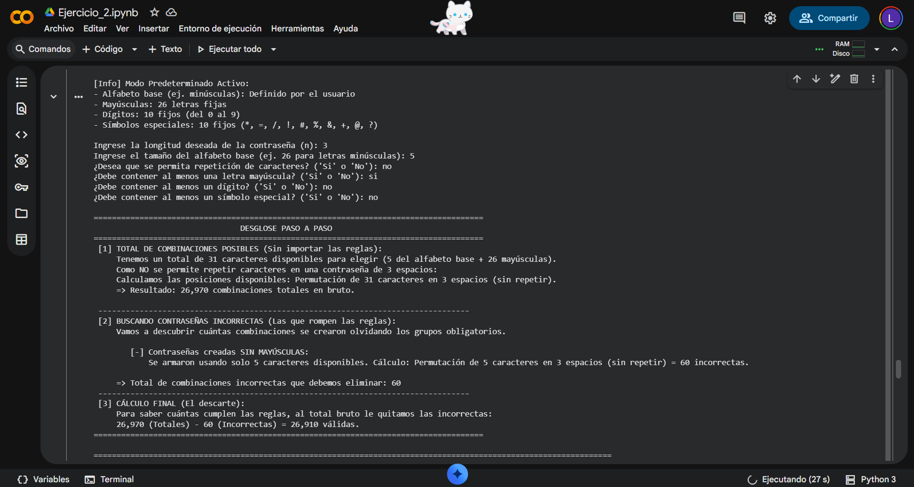
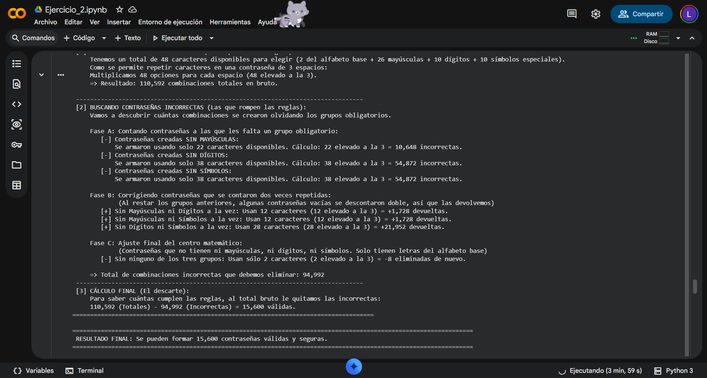
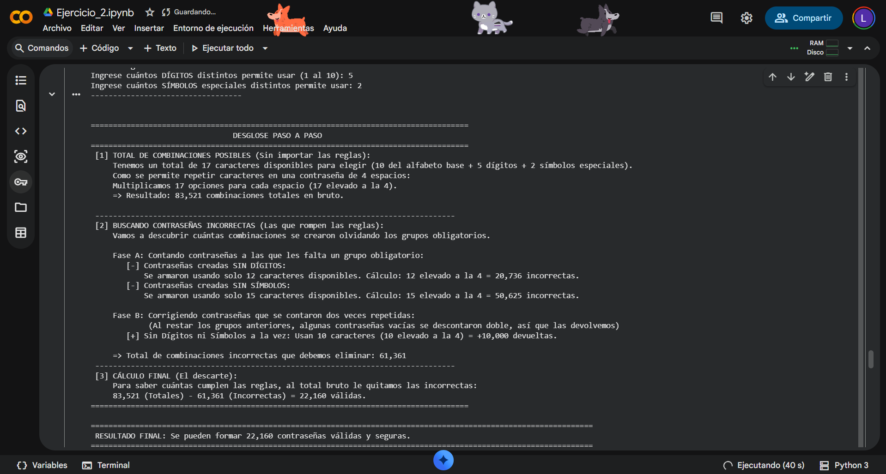
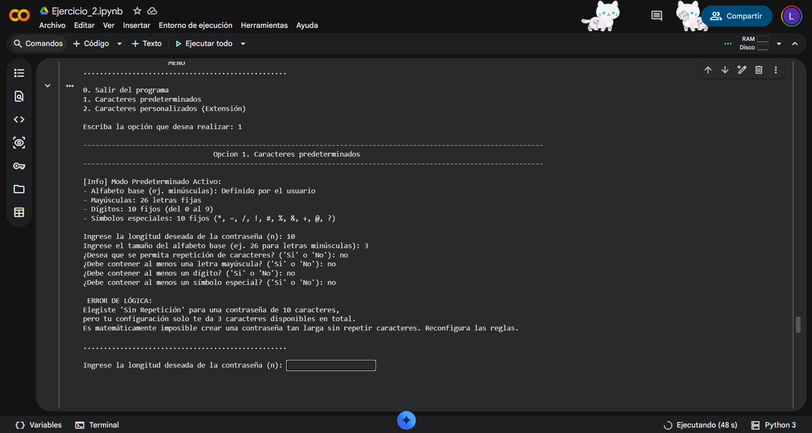
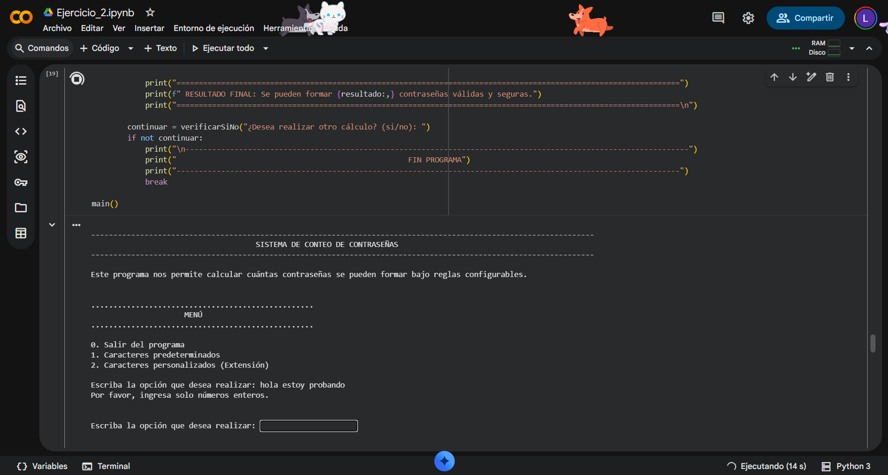

# Ejercicio 2: Sistema de Conteo de Contraseñas Seguras

> Toda la fundamentación matemática (principios combinatorios, regla del producto, principio de inclusión-exclusión y análisis de eficiencia) está documentada al detalle dentro de este cuaderno interactivo. Puede revisarlo directamente aquí en GitHub haciendo clic en el botón de **"View Notebook"** de arriba; si desea ejecutar el código, la plataforma le habilitará la opción de abrirlo en el entorno de Google Colab.

## Resumen del ejercicio

Este sistema permite calcular de forma exacta cuántas contraseñas se pueden generar bajo reglas de seguridad altamente configurables. El núcleo del ejercicio se divide en:

1. **Motor Combinatorio:** Un sistema que calcula el total de combinaciones posibles, permitiendo alternar entre conteo con o sin repetición.
2. **Sistema de Restricciones:** Implementación del **Principio de Inclusión-Exclusión** para filtrar combinaciones que no cumplen con los requisitos mínimos (ej. contraseñas sin dígitos, sin mayúsculas o sin símbolos).
3. **Extensión Personalizada:** Una funcionalidad opcional donde el usuario define el tamaño exacto de cada grupo de caracteres.

---

## Instrucciones de Ejecución en Google Colab

El código de este ejercicio está estructurado en bloques lógicos. Para ejecutar la aplicación correctamente:

1. Dé clic en el botón **Open In Colab** ubicado en la parte superior.
2. Diríjase a la sección **`4. Código Funcional`**.
3. Ejecute la celda de **`Funciones `** (esto inicializa las funciones de cálculo, validación y el motor de conteo).
4. Posteriormente, ejecute la celda de **`Programa Principal`** para invocar la función `main()`.
5. Interactúe con el menú desplegado (opciones 0 a 2) para realizar los conteos.

---

## Evidencias de Pruebas

Para demostrar la estabilidad y precisión del sistema, se ejecutó una prueba real por cada escenario de configuración:

### Prueba 1: 
* **Opción seleccionada:** Opción 1 (Caracteres predeterminados)
* **Datos:** Longitud $n=4$, Alfabeto base=6, Repetición=Sí, Obligatorio=Dígitos.
* **Resultado:** `64,240` combinaciones válidas.

---

### Prueba 2:
* **Opción seleccionada:** Opción 1 (Caracteres predeterminados)
* **Datos:** Longitud $n=3$, Obligatorio=Mayúsculas y Dígitos.
* **Resultado:** `43,680` combinaciones válidas tras limpiar solapamientos.

---

### Prueba 3: 
* **Opción seleccionada:** Opción 1 (Caracteres predeterminados)
* **Datos:** Longitud $n=3$, Repetición=No, Obligatorio=Mayúsculas.
* **Resultado:** `26,910` combinaciones válidas.

---

### Prueba 4: 
* **Opción seleccionada:** Opción 1 (Caracteres predeterminados)
* **Datos:** Longitud $n=3$, Obligatorio=Mayús, Dígitos y Símbolos.
* **Resultado:** `31,200` combinaciones válidas aplicando ajuste triple.

---

### Prueba 5: 
* **Opción seleccionada:** Opción 2 (Caracteres personalizados)
* **Datos:** Longitud $n=4$, Grupos definidos manualmente por el usuario.
* **Resultado:** `50,040` combinaciones válidas.

---

## Control de Errores y Validaciones

El sistema cuenta con un blindaje contra errores para garantizar la exactitud:

### 1. Validación de Lógica Matemática
Si el usuario solicita una contraseña "sin repetición" pero con una longitud mayor a la cantidad de caracteres disponibles, el programa detecta el error antes de calcular.

* **Resultado:** Mensaje `Es matemáticamente imposible crear una contraseña tan larga sin repetir.`

### 2. Blindaje de Entradas
Utiliza bloques `try-except` para filtrar letras en campos numéricos y asegurar que los rangos (como el límite de 1-10 para dígitos) sean respetados.

* **Resultado:** Mensaje `Por favor, ingresa solo números enteros positivos.`

